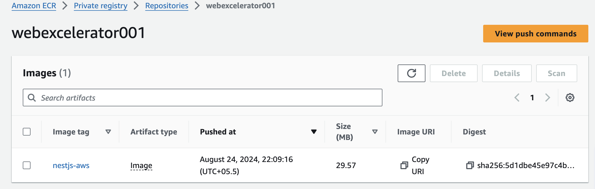

# NestJs App + Docker Production Image + Aws Container Registry

## Description

This is the project of nest.js and has the docker file included for the production ready deployment.

## Installation

```bash
$ npm install
```

## Running the app

```bash
# development
$ npm run start

# watch mode
$ npm run start:dev

# production mode
$ npm run start:prod
```

## Docker Image Build

```bash
# build the docker image for production
$ docker build -t nest-production:v1 -f Dockerfile.prod .
```

## Running the app in docker

```bash
# run the docker container
$ docker run -d -p 3000:3000 nest-production:v1
```

## AWS

```bash
# configure the aws cli
aws configure

# login to the container registry
aws ecr get-login-password --region us-east-1 | docker login --username AWS --password-stdin <registry-url>
```

## Terraform

```bash
# init terraform
terraform init

# before executing the infra creation confirm the plan
terraform plan

# executing the plan
terraform apply
```

## AWS ECR


